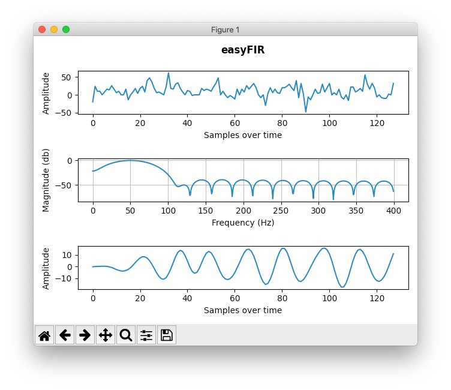

<p align="center">
  
  <h3 align="center">Simple FIR filer design tool and practical guide</h3></br>
  <p align="center">
	
  
  </p>
</p>
<br>

## About
Since the calculation and creation of digital filters is very complex, I designed the easyFIR project to reduce the amount of knowledge needed and provide an easy to apply digital filter solution for practically oriented progammers. This project allows users to enter some basic information about the filter they need and with the help of the visual charts created inside easyFIR, the user can tweak the filter to achieve the desired result.  

With the help of the "applyFilter" function mentioned in the "How can I use easyFIR in my project?" section below, you can easily create an almost "real time" filter in your project!

**Input:** an array/list of measured data - e.g. [10, 11, 15, 9, ... , -4, 11]

**Output:** an array/list of calculated coefficients, which in combination with the code below, returns the filtered input array

## Basic principle
This is a very complex topic but the most importrant thing for you to know is that the resulting filter is designed to work with a finite amount of samples - e.g. 64, 128, 256, ... samples.

In the image below, you can see how the filter affects an input of **7242** samples with the following design settings:
```python
filter_type = 3 # 1 = Lowpass, 2 = Highpass, 3 = Bandpass, 4 = Bandstop
filter_order = 300 # number of coefficients in the output String
sampling_frequency = 800 # in Hz
cutoff_frequency_1 = 40 # in Hz
cutoff_frequency_2 = 60 # in Hz - only needed if Bandpass filter selected
```


Also here is an example how the filter affects an input of **128** samples with the following design settings:
```python
filter_type = 3 # 1 = Lowpass, 2 = Highpass, 3 = Bandpass, 4 = Bandstop
filter_order = 30 # number of coefficients in the output String
sampling_frequency = 800 # in Hz
cutoff_frequency_1 = 40 # in Hz
cutoff_frequency_2 = 60 # in Hz - only needed if Bandpass filter selected
```


**BIG Note:** when tweaking the settings, you may get an error! Depending on the **filter_type** you selected, the **filter_order** must be even or odd! So just try adding 1 to the filter_order parameter when you get an error!

**Note:** since the resulting filter is strongly dependend on the input size, play around with different design settings until you find a curve that suits your needs. Also, as you can see, sometimes an "ugly" response curve can lead to a perfectly filtered output!

If you are interested in this topic, more information can be found here: [Wikipedia](https://en.wikipedia.org/wiki/Finite_impulse_response)

## How can I use easyFIR in my project?
EasyFIR calculates the required filter coefficients - the only thing left for you is to apply these coefficients to your project.

The example below shows how to apply the filter to a prefilled data array/list but as you can imgine, you can fill this array dynamically and so get an approximate "real time" filter!

#### Python
Start by creating a list containing your measured data as well as a list for the calculated coefficients (output of easyFIR):
```python
data = [14, 10, ... -40]
coefficients = [0.00810278836982443983, ... , 0.00810278836982443983]
```

Then just use a applyFilter function like the one below to apply the filter to your data:

```python
# idea copied from:
# https://stackoverflow.com/questions/20917019/how-to-implement-a-filter-like-scipy-signal-lfilter
def applyFilter(data, coefficients):
    N = len(coefficients)
    res = []
    for n,_ in enumerate(data):
        y = 0
        for i in range(N):
            if n < i:
                break
            y += coefficients[i] * data[n-i]
        res.append(y)
    return res
```

#### C/C++
Start by creating an array containing your measured data as well as an array for the calculated coefficients (output of easyFIR):
```c
int data[] = {14, 10, ... , -40};
double coefficients[] = {0.00810278836982443983, ... 0.00810278836982443983};
```

Then just use a applyFilter function like the one below to apply the filter to your data (SAMPLE_SIZE = 128):

```c
# https://stackoverflow.com/questions/20917019/how-to-implement-a-filter-like-scipy-signal-lfilter
int* applyFilter(int* data) {
    const int lenCoef = sizeof(coefficients)/sizeof(coefficients[0]);
    static int result[SAMPLE_SIZE] = {};

    for (int m = 0; m < SAMPLE_SIZE; m++) {
        double y = 0;
        for (int n = 0; n < lenCoef; n++) {
            if (m < n) {
                break;
            }
            y += coefficients[n] * data[m-n];
        }
        result[m] = y;
    }

    return result;
}
```

## Run easyFIR
To be able to run this software, make sure that you have installed the following dependencies:

- [scipy](https://www.scipy.org)
- [matplotlib](https://matplotlib.org/3.3.1/users/installing.html)
- [numpy](https://numpy.org/install/)

Then just run the `easyFIR.py` file like so:
```shell
python3 easyFIR.py samples/sampleSmall.txt
```
where the sampleSmall.txt is a file containing your measurements (single axis CSV format). In the samples folder, you can find two sample files I created to help you getting started.

In the `easyFIR.py` file, you can find a section called "ONLY CHANGE THE FOLLOWING 5 PARAMETERS" - just change the 5 lines below this section and tweak the filter to your liking.

**Result:** running the `easyFIR.py` file will output all coefficients in a long string. These coefficients are the ones need in the "applyFilter" function I mentioned above.

## Limitations
This Software only uses the hamming window to calculate the filter coefficients. If you like to use another method, feel free to adapt the [firwin](https://docs.scipy.org/doc/scipy/reference/generated/scipy.signal.firwin.html) function to your needs.

Also this Software is provided as-is!

Please feel free to adapt it to your needs and contribute to the project. I would be very grateful to include your improvements. Thanks for your support!

**WARNING:** Everyone is responsible for what he/she is doing! I am not responsible if you hurt yourself, torch your house or anything that kind trying to do build something new! You are doing everything at your own risk!
